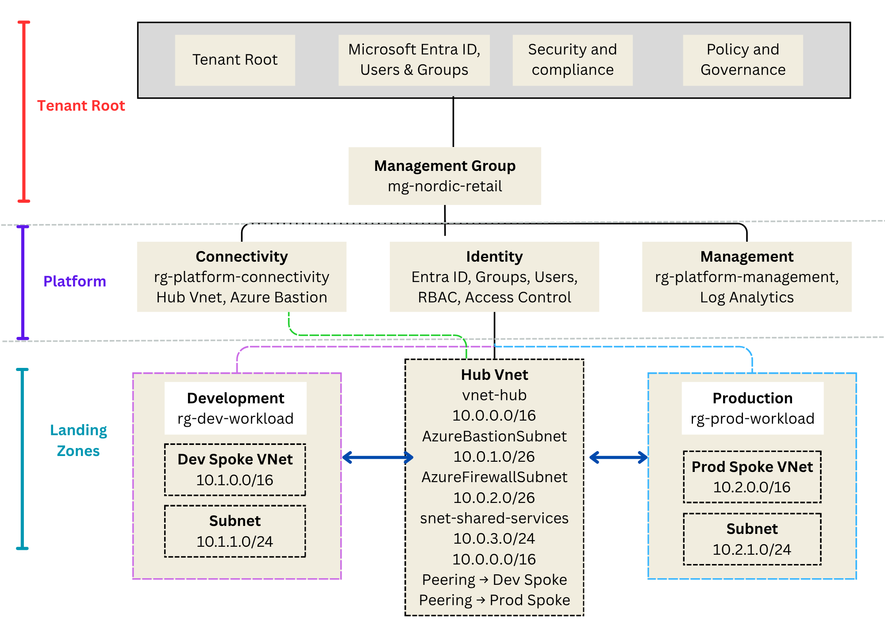
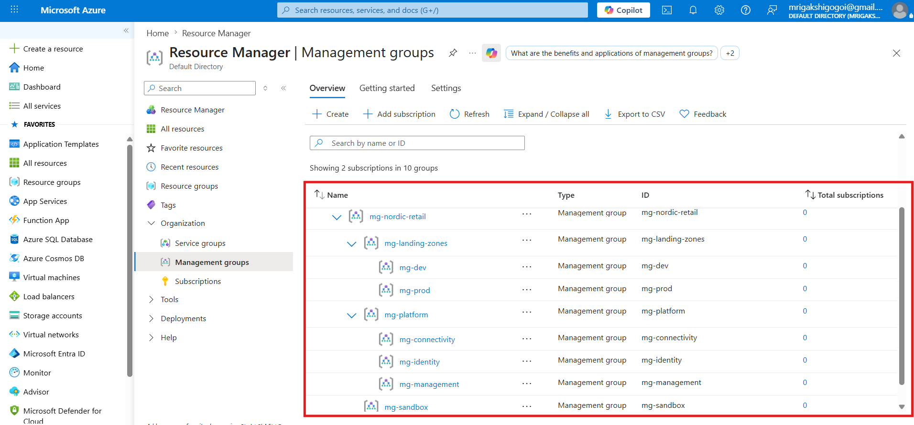
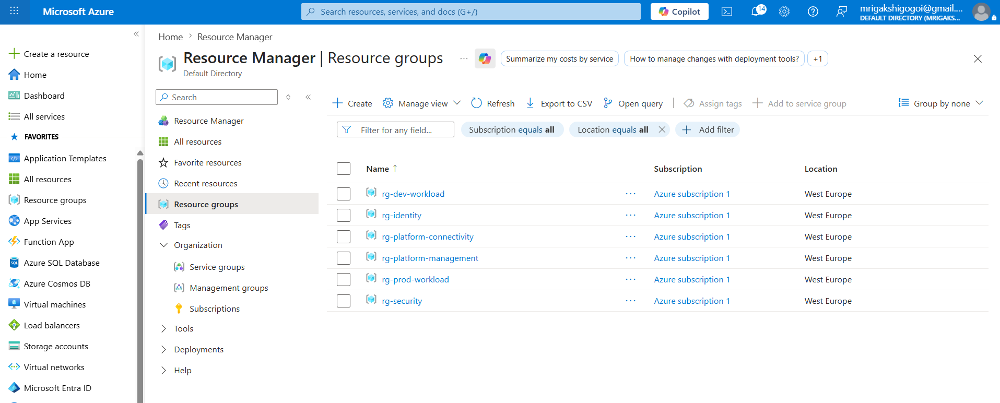
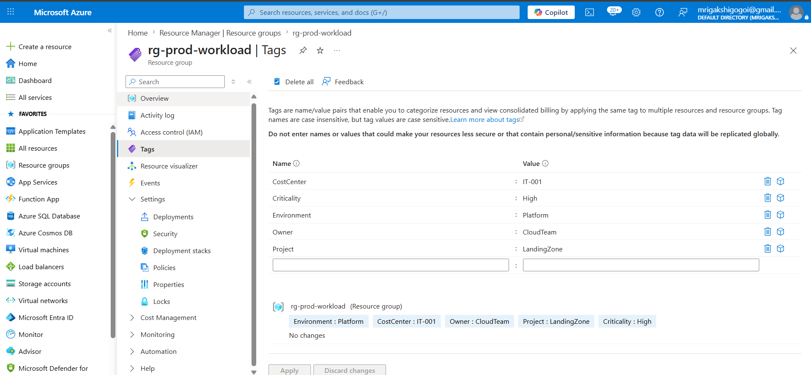
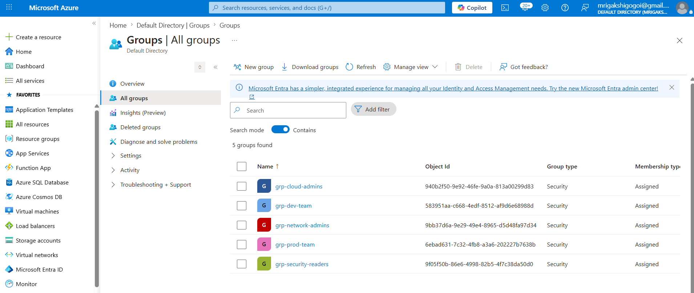
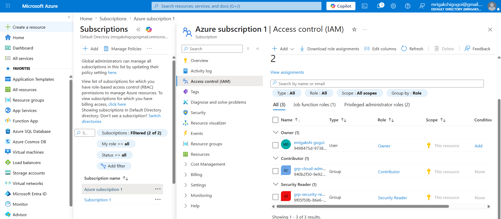
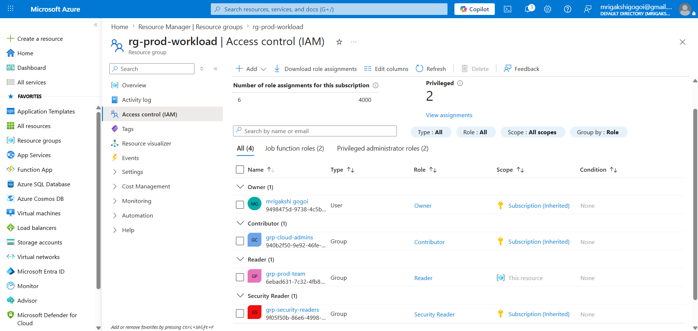
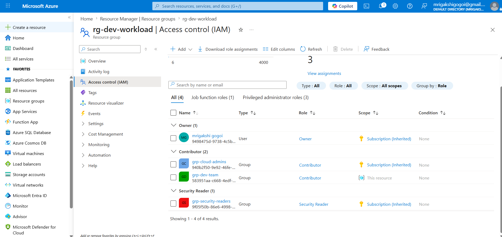

# End-to-End Azure Enterprise Landing Zone

## Project Overview

This project demonstrates the design and implementation of an enterprise-ready Azure Landing Zone based on Microsoft Cloud Adoption Framework (CAF) principles.

The objective is to establish a secure, scalable, and governed Azure foundation before deploying business workloads.

The implementation includes:

* Management Groups
* Resource Groups
* Microsoft Entra ID
* Azure RBAC
* Azure Policy
* Hub-and-Spoke Networking
* Azure Bastion
* Azure Key Vault
* Azure Monitor
* Log Analytics
* Cost Management
* Dev and Production Workloads

---

# Architecture

```text
Tenant Root Group
│
└── mg-nordic-retail
    │
    ├── mg-platform
    │   ├── mg-identity
    │   ├── mg-management
    │   └── mg-connectivity
    │
    ├── mg-landing-zones
    │   ├── mg-dev
    │   └── mg-prod
    │
    └── mg-sandbox
```

## Architecture Diagram





---

# Step 1: Create Management Group Hierarchy

Management groups help organize subscriptions and apply governance, Azure Policy, and RBAC across multiple environments. Microsoft notes that management groups are used to organize resources into a hierarchy for unified policy and access management.

## Management Groups Created

| Management Group | Purpose                  |
| ---------------- | ------------------------ |
| mg-nordic-retail | Parent Management Group  |
| mg-platform      | Shared Platform Services |
| mg-identity      | Identity Resources       |
| mg-management    | Monitoring Resources     |
| mg-connectivity  | Networking Resources     |
| mg-landing-zones | Workload Environments    |
| mg-dev           | Development Workloads    |
| mg-prod          | Production Workloads     |
| mg-sandbox       | Testing Environment      |

Tenant Root Group
│
└── mg-nordic-retail
    │
    ├── mg-platform
    │   ├── mg-identity
    │   ├── mg-management
    │   └── mg-connectivity
    │
    ├── mg-landing-zones
    │   ├── mg-dev
    │   └── mg-prod
    │
    └── mg-sandbox

## Screenshot





---

# Step 2: Create Resource Groups

Resource Groups were created to logically separate platform services, security resources, identity services, monitoring components, and workload environments.

## Resource Groups

| Resource Group | Purpose |
|---|---|
| rg-platform-connectivity | Hub network, Bastion, Firewall |
| rg-platform-management | Log Analytics and monitoring |
| rg-identity | Identity-related configuration |
| rg-dev-workload | Development workload resources |
| rg-prod-workload | Production workload resources |
| rg-security | Key Vault and security resources |

## Screenshot




---

# Step 3: Configure Naming Standards and Tags

Tags improve governance, ownership tracking, and cost management.

Naming standards and tags were implemented to improve governance, ownership tracking, and cost management across Azure resources.

## Naming Convention

| Resource Type | Convention |
|---------------|------------|
| Resource Group | rg-<environment>-<workload> |
| Virtual Network | vnet-<environment>-<purpose> |
| Subnet | snet-<purpose> |
| Network Security Group | nsg-<environment>-<workload> |
| Virtual Machine | vm-<environment>-<workload>-<number> |
| Key Vault | kv-<company>-<environment> |
| Log Analytics | log-<company>-<purpose> |

## Tags Used

| Tag | Example |
|------|---------|
| Environment | Dev / Prod |
| Owner | CloudTeam |
| CostCenter | IT-001 |
| Project | LandingZone |
| Criticality | Medium / High |

## Screenshot



## Key Learning

- Governance and standardization
- Resource ownership tracking
- Cost allocation strategy
- Enterprise Azure best practices

# Step 4: Configure Microsoft Entra ID Groups

Created Microsoft Entra ID security groups to organize users based on job responsibilities and support role-based access control (RBAC).

## Groups Created

| Group | Purpose |
|---------|---------|
| grp-cloud-admins | Full cloud administration |
| grp-network-admins | Network management |
| grp-security-readers | Security monitoring |
| grp-dev-team | Development environment access |
| grp-prod-team | Production read-only access |

## Screenshot



## Key Learning

- Identity and access management
- Security group administration
- Microsoft Entra ID
- RBAC preparation
- Enterprise governance

----

# Step 5: Configure Azure RBAC

Role-Based Access Control (RBAC) was implemented to enforce least-privilege access across the Azure Landing Zone.

RBAC assignments were configured using Microsoft Entra ID groups to ensure users receive only the permissions required to perform their job responsibilities.

## Role Assignments

| Group                | Role                | Scope                    |
| -------------------- | ------------------- | ------------------------ |
| grp-cloud-admins     | Contributor         | Subscription             |
| grp-security-readers | Security Reader     | Subscription             |
| grp-network-admins   | Network Contributor | rg-platform-connectivity |
| grp-dev-team         | Contributor         | rg-dev-workload          |
| grp-prod-team        | Reader              | rg-prod-workload         |

## Subscription-Level Assignments

Subscription-level permissions were assigned to administrative and security groups that require visibility and management access across the entire Azure environment.

### Assigned Roles

| Group                | Role            |
| -------------------- | --------------- |
| grp-cloud-admins     | Contributor     |
| grp-security-readers | Security Reader |

### Screenshot



---

## Resource Group-Level Assignments

Resource group-level permissions were assigned to workload-specific teams to ensure access is restricted according to the principle of least privilege.

### Assigned Roles

| Group              | Role                | Scope                    |
| ------------------ | ------------------- | ------------------------ |
| grp-network-admins | Network Contributor | rg-platform-connectivity |
| grp-dev-team       | Contributor         | rg-dev-workload          |
| grp-prod-team      | Reader              | rg-prod-workload         |

### Screenshot

rg-prod-workload



rg-dev-workload



---

## Key Learning

* Azure RBAC
* Microsoft Entra ID integration
* Subscription-level access control
* Resource Group-level access control
* Principle of Least Privilege
* Enterprise governance and security
* Access management using security groups

## RBAC Design

```text
Subscription
│
├── grp-cloud-admins
│   └── Contributor
│
├── grp-security-readers
│   └── Security Reader
│
├── rg-platform-connectivity
│   └── grp-network-admins
│       └── Network Contributor
│
├── rg-dev-workload
│   └── grp-dev-team
│       └── Contributor
│
└── rg-prod-workload
    └── grp-prod-team
        └── Reader
```

---

# Step 6: Create Hub Virtual Network

The Hub VNet hosts shared services and secure connectivity resources.

## Hub Network

```text
Name: vnet-hub
Address Space: 10.0.0.0/16
```

## Subnets

```text
AzureBastionSubnet
AzureFirewallSubnet
snet-shared-services
```

## Screenshot

```text
screenshots/06-hub-vnet.png
```

---

# Step 7: Create Development Spoke Network

The Development Landing Zone hosts non-production workloads.

## Dev Network

```text
Name: vnet-spoke-dev
Address Space: 10.1.0.0/16
Subnet: 10.1.1.0/24
```

## Screenshot

```text
screenshots/07-dev-spoke-vnet.png
```

---

# Step 8: Create Production Spoke Network

The Production Landing Zone hosts business-critical workloads.

## Prod Network

```text
Name: vnet-spoke-prod
Address Space: 10.2.0.0/16
Subnet: 10.2.1.0/24
```

## Screenshot

```text
screenshots/08-prod-spoke-vnet.png
```

---

# Step 9: Configure VNet Peering

Configured Hub-and-Spoke connectivity.

## Peerings

```text
peer-hub-to-dev
peer-dev-to-hub
peer-hub-to-prod
peer-prod-to-hub
```

## Screenshot

```text
screenshots/09-vnet-peering.png
```

---

# Step 10: Configure Network Security Groups

NSGs were created to control inbound and outbound traffic.

## Security Rules

| Rule                 | Port | Action |
| -------------------- | ---- | ------ |
| Allow HTTP           | 80   | Allow  |
| Allow HTTPS          | 443  | Allow  |
| Deny Internet RDP    | 3389 | Deny   |
| Allow Bastion Access | 3389 | Allow  |

## Screenshot

```text
screenshots/10-nsg-rules.png
```

---

# Step 11: Deploy Azure Bastion

Azure Bastion enables secure RDP and SSH connectivity without exposing public IP addresses.

## Screenshot

```text
screenshots/11-azure-bastion.png
```

---

# Step 12: Deploy Azure Key Vault

Azure Key Vault securely stores secrets and credentials.

## Key Vaults

```text
kv-nordicretail-dev
kv-nordicretail-prod
```

## Secrets Stored

```text
vm-admin-password
storage-access-key
database-connection-string
```

## Screenshot

```text
screenshots/12-key-vault-secrets.png
```

---

# Step 13: Configure Azure Policy

Azure Policy was implemented to enforce governance standards.

## Policies Assigned

* Require Resource Tags
* Restrict Allowed Regions
* Deny Public IP Addresses
* Require Secure Storage Transfer
* Audit Missing Backups

## Screenshots

```text
screenshots/13-policy-assignments.png
screenshots/14-policy-compliance.png
```

---

# Step 14: Configure Log Analytics Workspace

Centralized logging and monitoring were enabled.

## Workspace

```text
log-nordicretail-landingzone
```

## Screenshot

```text
screenshots/15-log-analytics-workspace.png
```

---

# Step 15: Enable Azure Monitor

Monitoring was enabled for:

* Virtual Machines
* Networking
* Activity Logs
* Security Events
* Performance Metrics

## Screenshot

```text
screenshots/16-azure-monitor-dashboard.png
```

---

# Step 16: Deploy Development VM

Development workload deployed into the Development Landing Zone.

## Virtual Machine

```text
vm-dev-web-01
```

## Screenshot

```text
screenshots/17-dev-vm.png
```

---

# Step 17: Deploy Production VM

Production workload deployed into the Production Landing Zone.

## Virtual Machine

```text
vm-prod-web-01
```

## Screenshot

```text
screenshots/18-prod-vm.png
```

---

# Step 18: Install IIS and Validate Workloads

Installed IIS on both virtual machines.

## Dev Page

```html
<h1>Hello from Dev Landing Zone</h1>
```

## Prod Page

```html
<h1>Hello from Prod Landing Zone</h1>
```

## Screenshot

```text
screenshots/19-workload-test-page.png
```

---

# Step 19: Configure Cost Management Budget

Created a monthly budget to monitor cloud spending.

## Budget Configuration

```text
Budget Name: budget-landingzone-monthly
Amount: 500 NOK
Alert Threshold: 80%
```

## Screenshot

```text
screenshots/20-cost-budget.png
```

---

# Project Validation Checklist

| Task                          | Status |
| ----------------------------- | ------ |
| Management Groups Created     | ✅      |
| Resource Groups Created       | ✅      |
| Entra ID Configured           | ✅      |
| RBAC Configured               | ✅      |
| Hub-and-Spoke Network Created | ✅      |
| VNet Peering Configured       | ✅      |
| NSGs Configured               | ✅      |
| Azure Bastion Deployed        | ✅      |
| Azure Key Vault Configured    | ✅      |
| Azure Policy Assigned         | ✅      |
| Log Analytics Configured      | ✅      |
| Azure Monitor Enabled         | ✅      |
| Development VM Deployed       | ✅      |
| Production VM Deployed        | ✅      |
| Cost Budget Created           | ✅      |

---

# Skills Demonstrated

* Azure Landing Zones
* Azure Governance
* Microsoft Entra ID
* Azure RBAC
* Azure Policy
* Azure Networking
* Hub-and-Spoke Architecture
* Azure Bastion
* Azure Key Vault
* Azure Monitor
* Log Analytics
* Cost Management
* Infrastructure as a Service (IaaS)
* Cloud Security
* Azure Administration

---

# Repository Structure

```text
azure-enterprise-landing-zone
│
├── README.md
│
├── architecture
│   └── landing-zone-architecture.png
│
├── screenshots
│   ├── 01-management-group-hierarchy.png
│   ├── 02-resource-groups.png
│   ├── 03-resource-tags.png
│   ├── 04-entra-id-groups.png
│   ├── 05-rbac-assignments.png
│   ├── 06-hub-vnet.png
│   ├── 07-dev-spoke-vnet.png
│   ├── 08-prod-spoke-vnet.png
│   ├── 09-vnet-peering.png
│   ├── 10-nsg-rules.png
│   ├── 11-azure-bastion.png
│   ├── 12-key-vault-secrets.png
│   ├── 13-policy-assignments.png
│   ├── 14-policy-compliance.png
│   ├── 15-log-analytics-workspace.png
│   ├── 16-azure-monitor-dashboard.png
│   ├── 17-dev-vm.png
│   ├── 18-prod-vm.png
│   ├── 19-workload-test-page.png
│   └── 20-cost-budget.png
│
└── docs
    ├── governance.md
    ├── networking.md
    ├── security.md
    ├── monitoring.md
    └── cost-management.md
```
