# End-to-End Azure Enterprise Landing Zone

## Project Overview

This project demonstrates the design and implementation of an enterprise-ready Azure Landing Zone based on Microsoft Cloud Adoption Framework (CAF) principles.

The objective is to establish a secure, scalable, and governed Azure foundation before deploying business workloads.

The implementation includes:

* Management Groups
* Resource Groups
* Microsoft Entra ID
* Azure RBAC
* Azure Policy
* Hub-and-Spoke Networking
* Azure Bastion
* Azure Key Vault
* Azure Monitor
* Log Analytics
* Cost Management
* Dev and Production Workloads

---


## Architecture Overview

The Azure Landing Zone follows a Hub-and-Spoke architecture aligned with Microsoft Cloud Adoption Framework principles.

### Platform Layer

- Connectivity
  - Hub Virtual Network
  - Azure Bastion
  - Shared Network Services

- Identity
  - Microsoft Entra ID
  - Security Groups
  - RBAC

- Management
  - Log Analytics Workspace
  - Monitoring and Governance

### Landing Zones

- Development Environment
  - Resource Group: rg-dev-workload
  - VNet: vnet-spoke-dev (10.1.0.0/16)

- Production Environment
  - Resource Group: rg-prod-workload
  - VNet: vnet-spoke-prod (10.2.0.0/16)

### Networking

- Hub VNet: 10.0.0.0/16
- Dev Spoke: 10.1.0.0/16
- Prod Spoke: 10.2.0.0/16
- Hub-to-Spoke VNet Peering
- Azure Bastion for secure administration

```text
Tenant Root
│
└── mg-nordic-retail
    │
    ├── Platform
    │   ├── Connectivity
    │   │    └── rg-platform-connectivity
    │   │         └── Hub VNet
    │   │
    │   ├── Identity
    │   │    └── Entra ID Groups
    │   │
    │   └── Management
    │        └── rg-platform-management
    │             └── Log Analytics
    │
    └── Landing Zones
        ├── Development
        │     └── rg-dev-workload
        │          └── Dev Spoke VNet
        │
        └── Production
              └── rg-prod-workload
                   └── Prod Spoke VNet
```

## Architecture Diagram


---

# Step 1: Create Management Group Hierarchy

Management groups help organize subscriptions and apply governance, Azure Policy, and RBAC across multiple environments. Microsoft notes that management groups are used to organize resources into a hierarchy for unified policy and access management.

## Management Groups Created

| Management Group | Purpose                  |
| ---------------- | ------------------------ |
| mg-nordic-retail | Parent Management Group  |
| mg-platform      | Shared Platform Services |
| mg-identity      | Identity Resources       |
| mg-management    | Monitoring Resources     |
| mg-connectivity  | Networking Resources     |
| mg-landing-zones | Workload Environments    |
| mg-dev           | Development Workloads    |
| mg-prod          | Production Workloads     |
| mg-sandbox       | Testing Environment      |

Tenant Root Group
│
└── mg-nordic-retail
    │
    ├── mg-platform
    │   ├── mg-identity
    │   ├── mg-management
    │   └── mg-connectivity
    │
    ├── mg-landing-zones
    │   ├── mg-dev
    │   └── mg-prod
    │
    └── mg-sandbox

## Screenshot


---

# Step 2: Create Resource Groups

Resource Groups were created to logically separate platform services, security resources, identity services, monitoring components, and workload environments.

## Resource Groups

| Resource Group | Purpose |
|---|---|
| rg-platform-connectivity | Hub network, Bastion, Firewall |
| rg-platform-management | Log Analytics and monitoring |
| rg-identity | Identity-related configuration |
| rg-dev-workload | Development workload resources |
| rg-prod-workload | Production workload resources |
| rg-security | Key Vault and security resources |

## Screenshot


---

# Step 3: Configure Naming Standards and Tags

Tags improve governance, ownership tracking, and cost management.

Naming standards and tags were implemented to improve governance, ownership tracking, and cost management across Azure resources.

## Naming Convention

| Resource Type | Convention |
|---------------|------------|
| Resource Group | rg-<environment>-<workload> |
| Virtual Network | vnet-<environment>-<purpose> |
| Subnet | snet-<purpose> |
| Network Security Group | nsg-<environment>-<workload> |
| Virtual Machine | vm-<environment>-<workload>-<number> |
| Key Vault | kv-<company>-<environment> |
| Log Analytics | log-<company>-<purpose> |

## Tags Used

| Tag | Example |
|------|---------|
| Environment | Dev / Prod |
| Owner | CloudTeam |
| CostCenter | IT-001 |
| Project | LandingZone |
| Criticality | Medium / High |

## Screenshot


## Key Learning

- Governance and standardization
- Resource ownership tracking
- Cost allocation strategy
- Enterprise Azure best practices

# Step 4: Configure Microsoft Entra ID Groups

Created Microsoft Entra ID security groups to organize users based on job responsibilities and support role-based access control (RBAC).

## Groups Created

| Group | Purpose |
|---------|---------|
| grp-cloud-admins | Full cloud administration |
| grp-network-admins | Network management |
| grp-security-readers | Security monitoring |
| grp-dev-team | Development environment access |
| grp-prod-team | Production read-only access |

## Screenshot


## Key Learning

- Identity and access management
- Security group administration
- Microsoft Entra ID
- RBAC preparation
- Enterprise governance

----

# Step 5: Configure Azure RBAC

Role-Based Access Control (RBAC) was implemented to enforce least-privilege access across the Azure Landing Zone.

RBAC assignments were configured using Microsoft Entra ID groups to ensure users receive only the permissions required to perform their job responsibilities.

## Role Assignments

| Group                | Role                | Scope                    |
| -------------------- | ------------------- | ------------------------ |
| grp-cloud-admins     | Contributor         | Subscription             |
| grp-security-readers | Security Reader     | Subscription             |
| grp-network-admins   | Network Contributor | rg-platform-connectivity |
| grp-dev-team         | Contributor         | rg-dev-workload          |
| grp-prod-team        | Reader              | rg-prod-workload         |

## Subscription-Level Assignments

Subscription-level permissions were assigned to administrative and security groups that require visibility and management access across the entire Azure environment.

### Assigned Roles

| Group                | Role            |
| -------------------- | --------------- |
| grp-cloud-admins     | Contributor     |
| grp-security-readers | Security Reader |

### Screenshot


---

## Resource Group-Level Assignments

Resource group-level permissions were assigned to workload-specific teams to ensure access is restricted according to the principle of least privilege.

### Assigned Roles

| Group              | Role                | Scope                    |
| ------------------ | ------------------- | ------------------------ |
| grp-network-admins | Network Contributor | rg-platform-connectivity |
| grp-dev-team       | Contributor         | rg-dev-workload          |
| grp-prod-team      | Reader              | rg-prod-workload         |

### Screenshot

rg-prod-workload


rg-dev-workload


---

## Key Learning

* Azure RBAC
* Microsoft Entra ID integration
* Subscription-level access control
* Resource Group-level access control
* Principle of Least Privilege
* Enterprise governance and security
* Access management using security groups

## RBAC Design

```text
Subscription
│
├── grp-cloud-admins
│   └── Contributor
│
├── grp-security-readers
│   └── Security Reader
│
├── rg-platform-connectivity
│   └── grp-network-admins
│       └── Network Contributor
│
├── rg-dev-workload
│   └── grp-dev-team
│       └── Contributor
│
└── rg-prod-workload
    └── grp-prod-team
        └── Reader
```

---

# Step 6: Create Hub Virtual Network

The Hub Virtual Network was created to host shared networking and security services for the Azure Landing Zone.

## Hub Network

| Setting | Value |
|----------|----------|
| Name | vnet-hub |
| Address Space | 10.0.0.0/16 |
| Resource Group | rg-platform-connectivity |

## Subnets

| Subnet | Address Range |
|----------|----------|
| AzureBastionSubnet | 10.0.1.0/26 |
| AzureFirewallSubnet | 10.0.2.0/26 |
| snet-shared-services | 10.0.3.0/24 |

## Screenshot

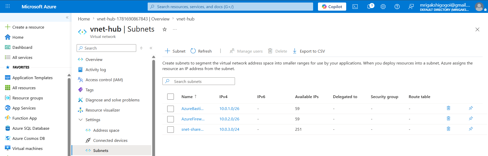

## Key Learning

- Azure Virtual Networks
- Hub-and-Spoke Architecture
- Network Segmentation
- Azure Bastion Requirements
- Azure Firewall Requirements
- Enterprise Landing Zone Networking
---

# Step 7: Create Development Spoke Network

The Development Spoke Network was created to host non-production workloads within the Azure Landing Zone.

## Development Network

| Setting | Value |
|----------|----------|
| Name | vnet-spoke-dev |
| Region | West Europe |
| Address Space | 10.1.0.0/16 |
| Resource Group | rg-dev-workload |

## Subnet

| Subnet | Address Range |
|----------|----------|
| snet-dev-workload | 10.1.1.0/24 |

## Screenshot

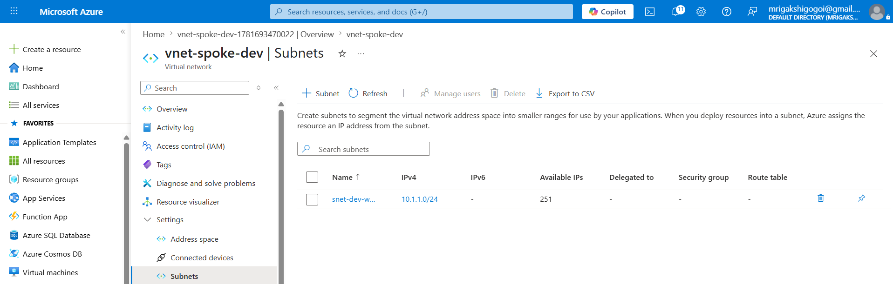

## Key Learning

- Azure Virtual Networks
- Network Segmentation
- Hub-and-Spoke Architecture
- Development Environment Isolation
- Azure Landing Zone Design

---

# Step 8: Create Production Spoke Network

The Production Spoke Network was created to host business-critical workloads within the Azure Landing Zone.

## Production Network

| Setting | Value |
|----------|----------|
| Name | vnet-spoke-prod |
| Region | West Europe |
| Address Space | 10.2.0.0/16 |
| Resource Group | rg-prod-workload |

## Subnet

| Subnet | Address Range |
|----------|----------|
| snet-prod-workload | 10.2.1.0/24 |

## Screenshot


## Key Learning

- Azure Virtual Networks
- Production Environment Isolation
- Hub-and-Spoke Architecture
- Network Segmentation
- Azure Landing Zone Design

---

# Step 9: Configure VNet Peering

Configured Hub-and-Spoke connectivity by creating VNet peerings between the Hub Virtual Network and the Development and Production Spoke Networks.

## Peerings

| Peering | Purpose |
|----------|----------|
| peer-hub-to-dev | Hub to Development |
| peer-dev-to-hub | Development to Hub |
| peer-hub-to-prod | Hub to Production |
| peer-prod-to-hub | Production to Hub |

## Screenshot

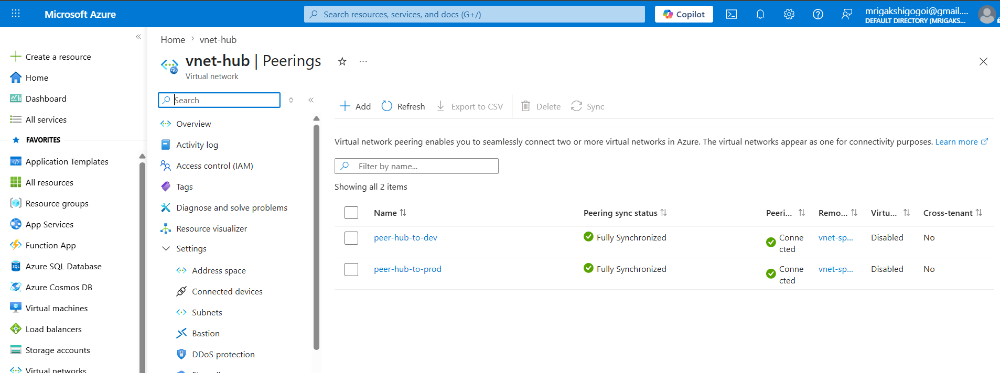

## Key Learning

- Azure VNet Peering
- Hub-and-Spoke Architecture
- Network Connectivity
- Azure Networking
- Enterprise Landing Zone Design
---

# Step 10: Configure Network Security Groups

Network Security Groups (NSGs) were configured to control inbound traffic and secure workload environments.

## Security Rules

| Rule | Port | Action |
|------|------|--------|
| Allow-HTTP | 80 | Allow |
| Allow-HTTPS | 443 | Allow |
| Allow-Bastion-RDP | 3389 | Allow |
| Deny-Internet-RDP | 3389 | Deny |

## Screenshot

Network Security Groups

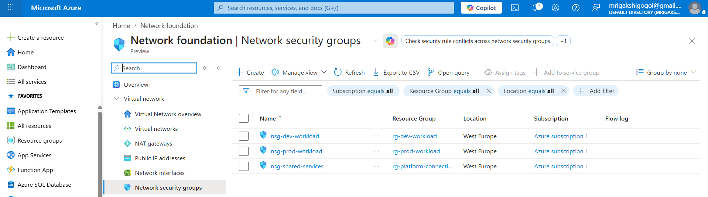

Network Security Groups Rules

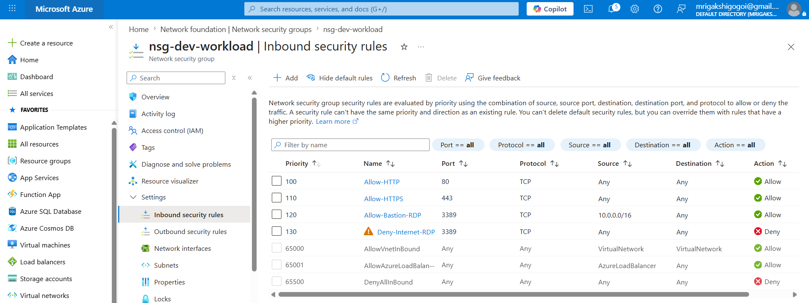

## Key Learning

- Azure Network Security Groups
- Security Rule Priorities
- Bastion-based Secure Access
- Least Privilege Networking
- Network Segmentation

---

# Step 11: Deploy Azure Bastion

Azure Bastion was deployed in the Hub Virtual Network to provide secure RDP and SSH access to virtual machines without exposing public IP addresses.

## Bastion Configuration

| Setting | Value |
|----------|----------|
| Name | bastion-hub |
| Resource Group | rg-platform-connectivity |
| Region | West Europe |
| Virtual Network | vnet-hub |
| Subnet | AzureBastionSubnet |
| Public IP | pip-bastion-hub |

## Screenshot

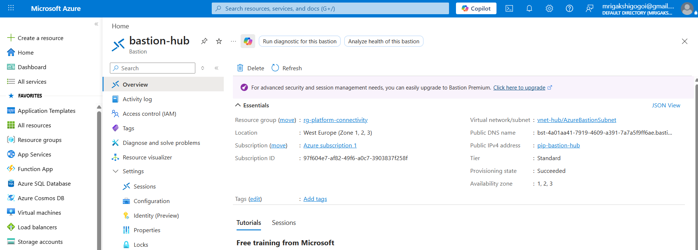

## Key Learning

- Azure Bastion
- Secure Remote Administration
- RDP without Public IP
- SSH without Public IP
- Hub-and-Spoke Architecture
- Azure Landing Zone Security

---

# Step 12: Deploy Azure Key Vault

Azure Key Vault was deployed to securely store application secrets, passwords, and connection strings.

## Key Vaults

| Key Vault | Purpose |
|------------|------------|
| kv-nordicretail-dev | Development secrets |
| kv-nordicretail-prod | Production secrets |

## Secrets Stored

| Secret |
|------------|
| vm-admin-password |
| storage-access-key |
| database-connection-string |

## Screenshot

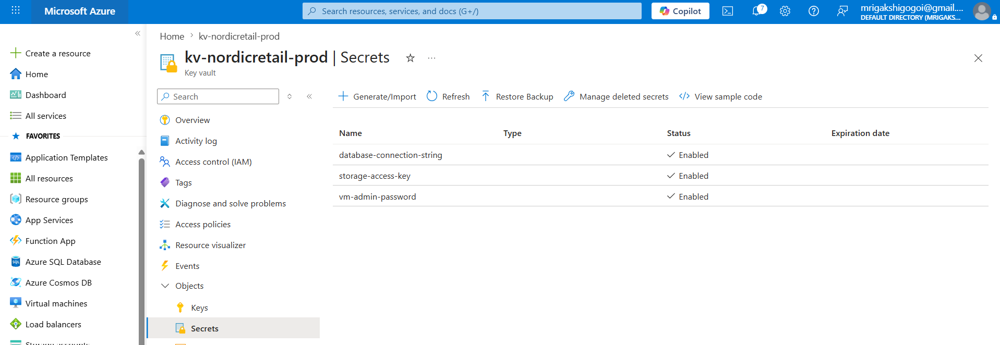

## Key Learning

- Azure Key Vault
- Secret Management
- Secure Credential Storage
- Environment Separation
- Azure Security Best Practices
- Landing Zone Security Architecture

---

# Step 13: Configure Azure Policy

Azure Policy was implemented to enforce governance, security, and compliance standards across the Azure Landing Zone.

## Policies Assigned

| Policy | Purpose |
|----------|----------|
| Require Resource Tags | Enforce resource tagging standards |
| Allowed Locations | Restrict deployments to approved regions |
| Not Allowed Resource Types | Prevent creation of Public IP Addresses |
| Secure Transfer Required | Enforce HTTPS for Storage Accounts |
| Audit Missing Backups | Identify workloads without backup protection |

## Policy Assignments

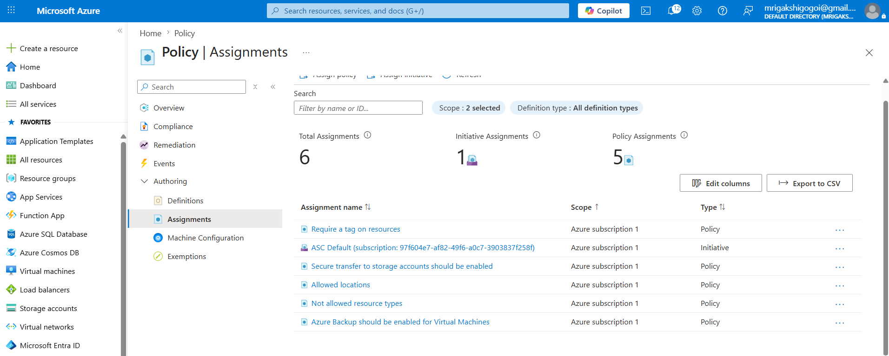

## Compliance Overview

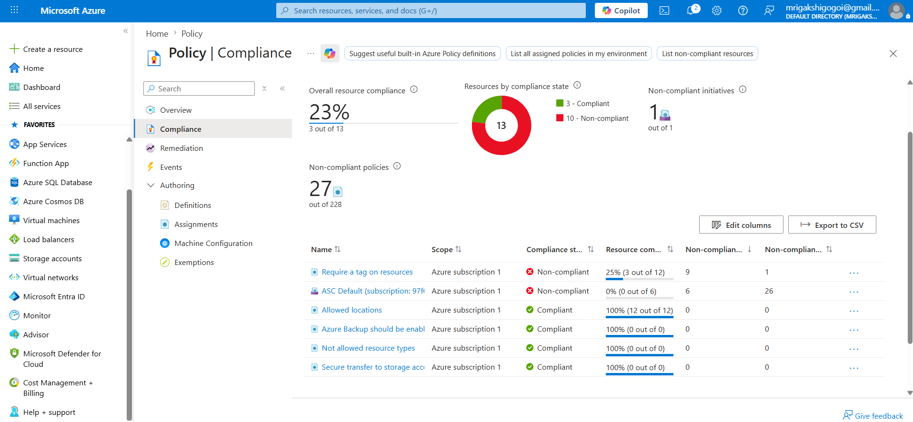

## Policy Enforcement Validation

Azure Policy successfully prevented deployment of a resource that did not comply with the organization's tagging standards.

### Screenshot

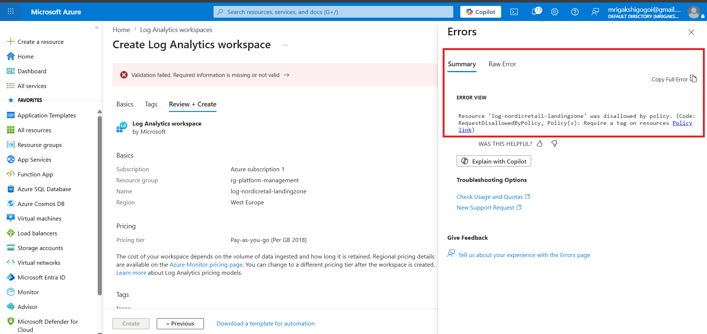

### Result

The Log Analytics Workspace deployment was blocked because the required resource tags were not specified, demonstrating Azure Policy governance enforcement.

## Key Learning

- Azure Policy
- Governance
- Compliance Management
- Resource Standardization
- Cost Control
- Security Best Practices
- Landing Zone Governance

---

# Step 14: Configure Log Analytics Workspace

A centralized Log Analytics Workspace was deployed to provide monitoring, diagnostics, and operational insights across the Azure Landing Zone.

## Workspace

| Setting | Value |
|----------|----------|
| Name | log-nordicretail-landingzone |
| Resource Group | rg-platform-management |
| Region | West Europe |

## Monitoring Sources

- Azure Activity Logs
- Azure Bastion Diagnostics
- Azure Policy Compliance
- NSG Diagnostics
- Virtual Machine Monitoring

## Screenshot

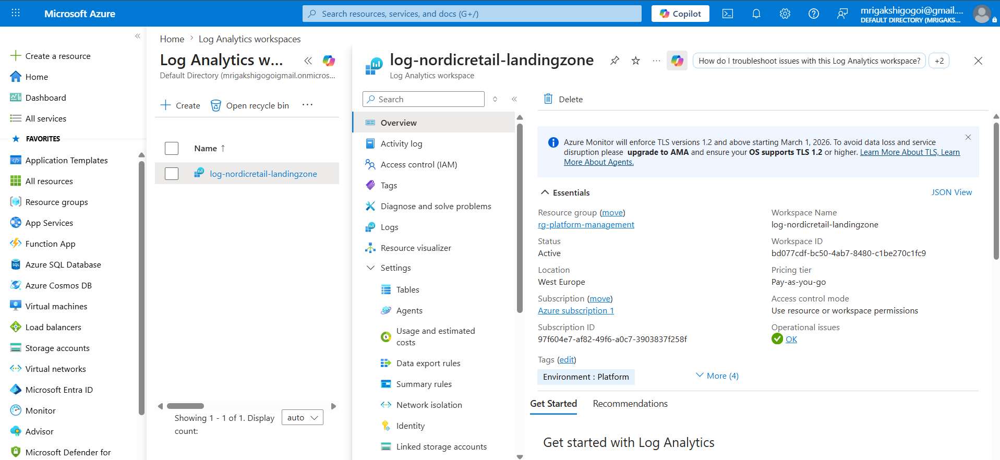

## Key Learning

- Azure Monitor
- Log Analytics
- Centralized Monitoring
- Operational Insights
- Azure Diagnostics
- Landing Zone Observability
---

# Step 15: Enable Azure Monitor

Azure Monitor was enabled to provide centralized monitoring and operational visibility across the Azure Landing Zone.

## Monitoring Capabilities

- Activity Logs
- Alerts
- Metrics
- Log Analytics Integration
- Service Health Monitoring
- Resource Diagnostics

## Screenshot

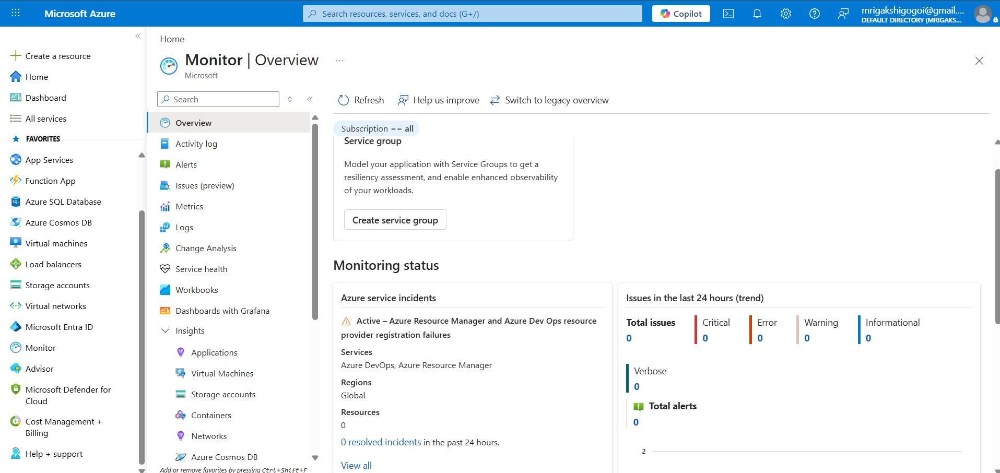
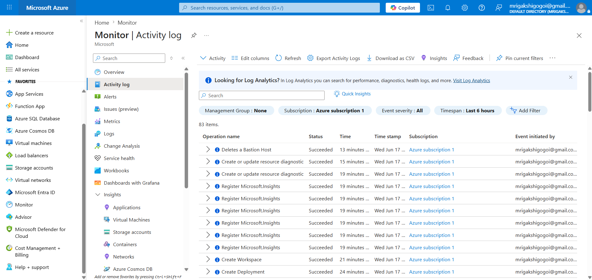

## Key Learning

- Azure Monitor
- Centralized Monitoring
- Activity Log Analysis
- Metrics Collection
- Service Health Monitoring
- Landing Zone Observability
---

# Step 16: Deploy Development VM

A development workload virtual machine was deployed into the Development Landing Zone.

## Virtual Machine

| Setting | Value |
|----------|----------|
| Name | vm-dev-web-01 |
| Resource Group | rg-dev-workload |
| Region | West Europe |
| Virtual Network | vnet-spoke-dev |
| Network Security Group | nsg-dev-workload |
| Public IP | None |
| Access Method | Azure Bastion |

## Screenshot

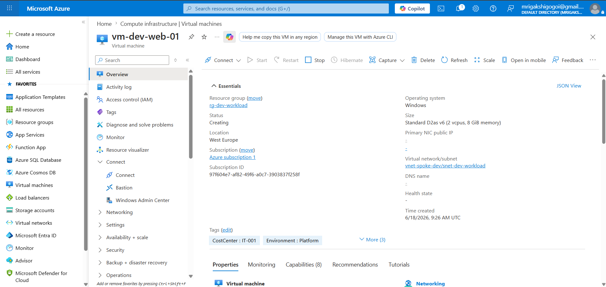

Azure Bastion connection
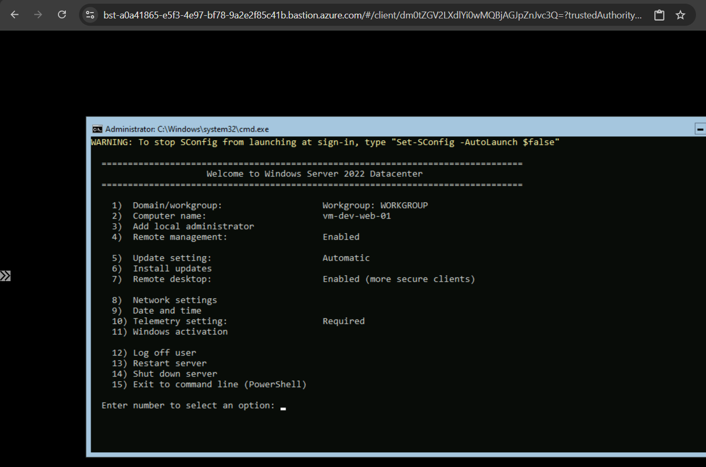

## Key Learning

- Azure Virtual Machines
- Landing Zone Workloads
- Private Networking
- Azure Bastion Access
- Network Security Groups
- Hub-and-Spoke Architecture
---

# Step 17: Deploy Production VM

A production workload virtual machine was deployed into the Production Landing Zone.

## Virtual Machine

| Setting | Value |
|----------|----------|
| Name | vm-prod-web-01 |
| Resource Group | rg-prod-workload |
| Region | West Europe |
| Virtual Network | vnet-spoke-prod |
| Network Security Group | nsg-prod-workload |
| Public IP | None |
| Access Method | Azure Bastion |

## Screenshot

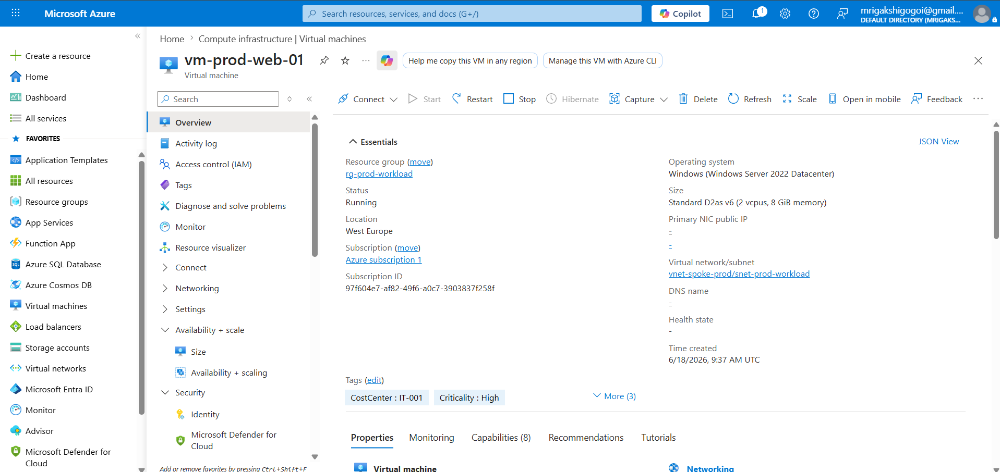

Azure Bastion connection


## Key Learning

- Azure Virtual Machines
- Production Landing Zones
- Workload Isolation
- Network Segmentation
- Hub-and-Spoke Architecture
- Infrastructure Deployment

---

# Step 18: Install IIS and Validate Workloads

Installed IIS on both virtual machines.

## Dev Page

```html
<h1>Hello from Dev Landing Zone</h1>
```

## Prod Page

```html
<h1>Hello from Prod Landing Zone</h1>
```

## Screenshot

```text
screenshots/19-workload-test-page.png
```

# Step 19: Configure Cost Management Budget

A monthly Azure budget was created to monitor cloud spending and provide proactive cost control.

## Budget Configuration

| Setting | Value |
|----------|----------|
| Budget Name | budget-landingzone-monthly |
| Amount | 50 USD |
| Period | Monthly |
| Alert Threshold | 80% |
| Scope | Azure Subscription |

## Screenshot

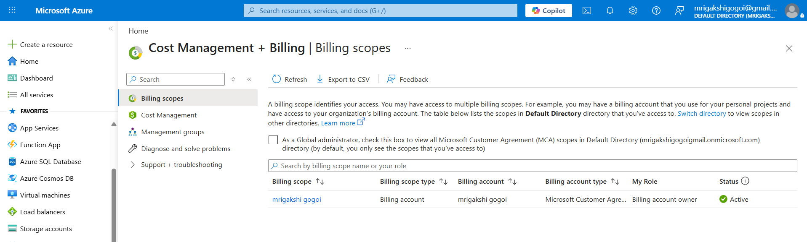

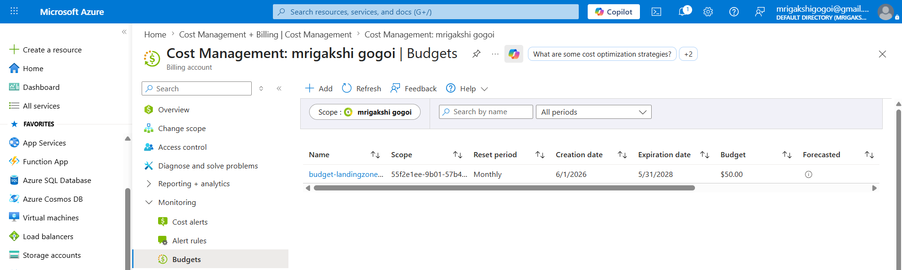

## Key Learning

- Azure Cost Management
- Budget Planning
- Cost Governance
- Spending Alerts
- Financial Operations (FinOps)
- Landing Zone Cost Control

---

# Project Validation Checklist

| Task                          | Status |
| ----------------------------- | ------ |
| Management Groups Created     | ✅      |
| Resource Groups Created       | ✅      |
| Entra ID Configured           | ✅      |
| RBAC Configured               | ✅      |
| Hub-and-Spoke Network Created | ✅      |
| VNet Peering Configured       | ✅      |
| NSGs Configured               | ✅      |
| Azure Bastion Deployed        | ✅      |
| Azure Key Vault Configured    | ✅      |
| Azure Policy Assigned         | ✅      |
| Log Analytics Configured      | ✅      |
| Azure Monitor Enabled         | ✅      |
| Development VM Deployed       | ✅      |
| Production VM Deployed        | ✅      |
| Cost Budget Created           | ✅      |

---

# Skills Demonstrated

* Azure Landing Zones
* Azure Governance
* Microsoft Entra ID
* Azure RBAC
* Azure Policy
* Azure Networking
* Hub-and-Spoke Architecture
* Azure Bastion
* Azure Key Vault
* Azure Monitor
* Log Analytics
* Cost Management
* Infrastructure as a Service (IaaS)
* Cloud Security
* Azure Administration

---
